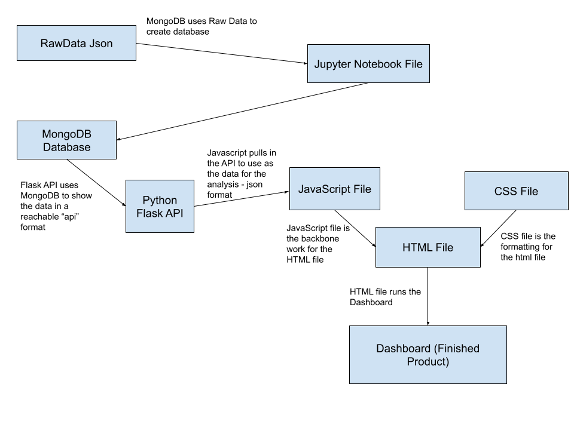

# project-3
## Table of Contents

- [Project Description/Outline](#project_description)
- [Questions](#questions)
- [Contents of the Repository](#repository_contents)
- [Task Assignments](#task_assignments)
- [Givens](#givens)
- [Conclusion](#conclusion)

## Project_Description
Our group is attempting to look at the differences between the houses at Hogwarts. Using the data of all of the known characters in the movies, we will be investigating the similarities and differences. We will then create a visualization dashboard to help display the data. 

We then created a PowerPoint to help present what was found. That can be found here: https://docs.google.com/presentation/d/1_9F5unn04Ntu5zw7uiUeS6xLyVfiSmdIajbLp7erzJI/edit?usp=sharing .  

## Questions
1. What are the percentages of female vs male in each house?
2. What are the most popular professions to come out of each house?
3. What Blood Status lead to each house?
4. Who are the people from the books in each house? Count?

## Repository_Contents

Python File -> app\_solution.py creates a Flask API which powers the mongoDB database in a json format for access when run locally  
Pandas Notebook -> mongodb\_creation.ipynb which creates the mongodb database, removes the duplicates and reenters data to be used. Data is fully manipulated in file and tested. 
README.md  
### Templates Folder
HTML File-> index.html displays the dashboard as well as pulls from the API and overall brings everything together 
#### Data
Conatains 2 data files. 1 is the json which is the original Raw Data. The other is a cleaned csv we used to determine if the dataset was good or not. 
JSON File -> HPCharactersDataRaw.json  
#### Images
Contains all images used for the background of the dashboard and the README file. 
#### Static/js
JavaScript File-> app.js which creates the visualizations and manipulates the dropdown 

## Task_Assignments
Ryland - Initial Setup, File Connection, Data Manipulation 
Brittney - Question 1, Material Knowledge, PowerPoint Creation, JavaScript Formatting Template 
Jonah - Question 2, PowerPoint Improvement 
Tiffany - Question 3, Data Finder, PowerPoint Improvement, JavaScript Library Research, Organization 

## Givens
Instructions were generated by edX Boot Camps LLC, and is intended for educational purposes only. 
Data was provided by: https://www.kaggle.com/datasets/zez000/characters-in-harry-potter-books

## Conclusion
    

